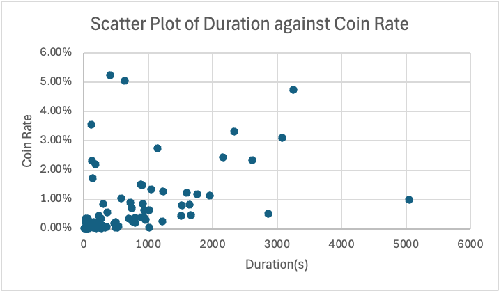

# Bilibili Knowledge Sector Engagement & Content Strategy Analysis

> **Objective:** To quantify the relationship between **Video Duration** and **User Engagement** (Coins/Favorites) in Bilibili's Knowledge Sector.

---

### 1. Key Insights
By analyzing the Top 100 ranking videos in the Knowledge Section, I discovered a distinct divergence between **Traffic** and **Quality**:

*   **The "Quality" Gap:** Long videos (>10 mins) achieve a **Coin-to-View Ratio of 1.27%** (12.7 coins per 1k views), which is **4x higher** than short videos (0.32%).
*   **The "Traffic" Hub:** Medium-length videos (3-10 mins) generate the highest average traffic (~2.4M views), acting as the primary funnel for user acquisition.
*   **Scatter Plot Revelation:** As seen in the visualization, short videos (<300s) cluster heavily at the bottom-left (low engagement), while "High-Value" outliers (Coin Rate > 3%) are exclusively found in videos longer than 5 minutes.

### 2. Visualization
**Figure 1: Engagement Distribution (Duration vs. Coin Rate)**
The scatter plot below shows that *Short Content* struggles to convert views into hard currency (Coins), whereas *Medium-to-Long Content* drives higher user commitment.

### 3. Tech Stack & Methodology
*   **Data Acquisition:** Python (`requests`, `pandas`) script with anti-bot bypass to fetch Ranking V2 API data.
*   **Data Storage:** Processed raw JSON into structured CSV datasets.
*   **Analysis Engine:** **SQL (SQLite)** for segmentation, aggregation, and weighted metric calculation.
*   **Visualization:** Excel

### 4. How to Run
1. Update the `COOKIE` in `Scraper.py` with your own Bilibili credentials (SESSDATA Cookies).
2. Run `scraper.py` to fetch fresh data.
3. Run `analysis_sql.py` to see the SQL query results.
